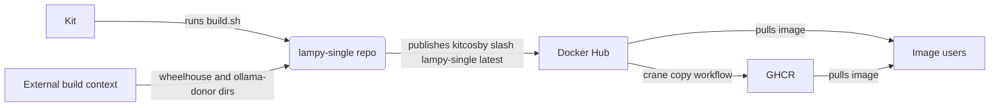
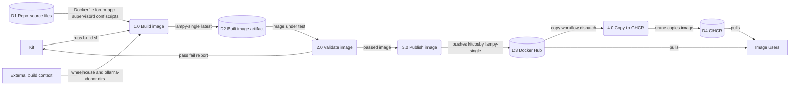
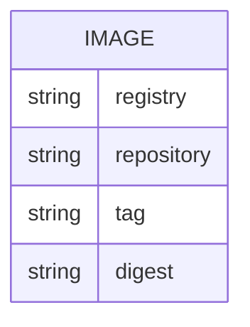

Living document — update these diagrams when adding features.

# lampy-single — Architecture

The lampy-single repo is the Docker single-container build for the Lampy forum stack: a Dockerfile, supervisord config, the Flask forum app source, build and validation scripts, and a GitHub Actions workflow that copies the published image from Docker Hub to GHCR.

## 1. Context diagram (level 0)

## 2. Level-1 data flow diagram

## 3. Entity–relationship diagram

No persistent data model observed — the repo is a build recipe; there is no database or schema of its own. The forum-app schema.sql in the repo belongs to the Flask app's runtime database, not to this repo. The only persisted artifacts are container image records in the registries:

## Grounding notes

- OBSERVED: README.md states the image runs the full Lampy forum stack (PostgreSQL with TimescaleDB and pgvector, Apache, Ollama with Gwen, James mail server, code-server, pgai-vectorizer worker, Flask forum app), pullable from Docker Hub `kitcosby/lampy-single:latest` and GHCR `ghcr.io/cosbykit-afk/lampy-single:latest`, both pointing to digest `sha256:69a30fb52d664e31105972d88b1d243d923e2bb8474e2c531e08a55e004455` (first 64 hex chars of the digest shown verbatim in README).
- OBSERVED: the Dockerfile header lists the seven supervisord services and says the Dockerfile expects `wheelhouse/` and `ollama-donor/` directories in the build context, explicitly noted as NOT in this repo.
- OBSERVED: `build.sh`, `build-cloud.sh`, `build-wheelhouse.sh`, `pressure-test.sh` exist at repo root; README says pressure-test.sh checks the image filesystem for required binaries, configs, symlinks, and scans for leaked secrets.
- OBSERVED: `.github/workflows/copy-to-ghcr.yml` is a manual workflow-dispatch job that uses crane to copy `docker.io/kitcosby/lampy-single:latest` to `ghcr.io/cosbykit-afk/lampy-single:latest`.
- OBSERVED: `forum-app/` contains `app.py`, `config.py`, `requirements.txt`, `schema.sql`, and 11 Jinja templates — the Flask forum source bundled into the image at build time.
- INFERRED: the exact build trigger (Kit runs build.sh by hand vs a scheduled run) — no CI build workflow exists in the repo, only the GHCR copy workflow, so the build step is manual.
- INFERRED: image consumers beyond Kit — the public-registry pulls and the LICENSE/unlicense files imply other users may pull the image, but no consumer list was observed.
